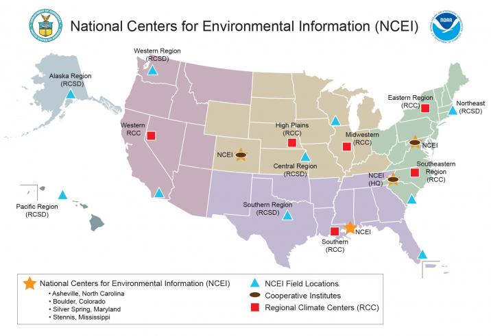

# README
DeanLiddell  
Friday, May 29, 2015  
<link rel="stylesheet" type="text/css" href="stylesheets/stylesheet.css">

## Data Source

*(message from NOAA...)*

NOAA's former three data centers have merged into the National Centers for 
Environmental Information (NCEI). The demand for high-value environmental data 
and information has dramatically increased in recent years. To improve our 
ability to meet that demand, NOAA’s former three data centers – the 
[National Climatic Data Center][01], the [National Geophysical Data Center][02], 
and the [National Oceanographic Data Center][03], which includes the 
[National Coastal Data Development Center][04] – have merged into the National Centers 
for Environmental Information (NCEI).

<center></center>

"...(NCEI) is responsible for preserving, monitoring, assessing, and providing 
public access to the Nation's treasure of climate and historical weather 
data and information." For climate information, data acess, and support refer
to the U.S. Department of Commerce, National Oceanic and Atmospheric 
Administration web site: [www.ncei.noaa.gov.][05]. For information relevant to
the Archival Data Sets listed below, refer to 
[National Weather Service Instruction 10-1605][06], Storm Data Preparation.

## Data Sets

The directive listed above (National Weather Service Instruction 10-1605), which
is part of NOAA's Operations and Services Performance Standards, dating from 
August 2007, provides a comprehensive "Storm Data Event Table" which standardizes
the "Event Name" and "Designator" that will be used to record all observed
severe weather events. *(NOAA)* "The only events permitted in Storm Data are listed 
in this table. The chosen event name should be one that describes the meterological
event leading to fatalities, injuries, damage, etc."

### Storm Events Database

The database currently contains data from January 1950 to January 2015, as entered 
by NOAA's National Weather Service (NWS). Due to changes in the data collection 
and processing procedures over time, there are unique periods of records available 
depending on the event type. 

1.  <u>Tornado</u>: From 1950 through 1954, only tornado events were recorded.  

2.  <u>Tornado, Thunderstorm Wind, and Hail</u>: From 1955 through 1992, only 
    tornado, thunderstorm wind and hail events were keyed from the paper 
    publications into digital data. From 1993 to 1995, only tornado, thunderstorm 
    wind and hail events have been extracted from the [Unformatted Text Files.][07]  
    
3.  <u>All Event Types (48 from Directive 10-1605)</u>: From 1996 to present, 48 
    event types are recorded as defined in NWS Directive 10-1605.

4.  NOTE: In addition to the above three(3) items, the Storm Events Database 
    (above link) also lists important information on "Collection Sources" and
    "Supplemental Information" necessary to understanding the data series.

The various files that comprise the Storm Events Database are available from
NOAA via HTTP or FTP. For the later, the top of the folder tree for storm
events starts [here][08]. If you are using Windows® then it would be best to open 
the FTP site in your Windows Explorer rather than use your browser. If you happen 
to be using Mozilla, then an add-in like DownThemAll! is likely the most useful 
tool for pulling data to your machine since the application supports multiple 
concurrent streams, in this case only limited by NOAA server policies.

Overall, the Storm Events Database (either presented in separate per-year files
for each reporting type, or in a comprehesive Microsoft® Access database, which
is available on the site for download) still relies on the original reporting
methods during each time-span (above) as opposed to updating the entire data set
with the "Event Types" defined in Directive 10-1605. Considering the usefulness
of this later approach led to the creation of a "concordance" table.

### Concordance Tables

Concordance tables provide the means to establish a relationship between two or
more classification systems. In the case of the _Storm Events Database_ we are
dealing mostly with the failure to adhere to standardized classifications (by 
its sheer historical span), particularly in light of recent NOAA directives 
(such as 10-1605) that have (as of 2007) established reporting practices 
consistent with Federally mandated standards. Some of the relationships we want 
to establish are proper naming and formatting conventions for states (and state 
equivalents), counties (and county equivalents), placenames, and geologic and 
geographic positioning. (Many of these are set by the U.S. Department of
Interior, U.S. Geologic Survey, and the U.S. Board on Geographic Names)

For economic reporting we also want to derive information from this database 
that is relevant, and that means expressing all its measures in current terms.
Historical perspectives are interesting (good, informed decisions are often 
based on analyses of historic and present conditions), but if our analysis were 
to be used as a planning tool then we need to express the impact of severe 
weather in current and prospective future terms. For this we will use a number 
of conversion factors to scale the information contained in the 
_Storms Event Database_. For example, the Federal Reserve System 
(_Federal Reserve Economic Data – FRED_) maintains over 11,000 relevant 
time-series datasets, one of which is the Consumer-Price-Index for Urban 
Consumers over all categories of costs (this information being derived from the 
original source: Bureau of Economic Analysis of the U.S. Department of Commerce). 
Since the data in available on-line we can easily incorporate it into our 
analysis with the _quantmod_ package that is typlically included in the base _R_ 
distribution.

Most of the concordance tables we will propose will deal mostly with the forty-
eight (48) contiguous states. Alaska, Hawaii, and U.S. territories and minor
outlying islands will be clusted under a single category in some instances. This
will have the effect of aligning recent reporting with historical reports which
had a very narrow focus between the periods January 1950 to January 1996, before
the database (beginning January 1996) incorporated all severe weather events.

There is also the matter of realignment in reporting – such as adding and 
removing geographic and maritime regions and zones, renaming and/or redesignating
such areas, adding and removing National Weather Service field and state offices
and weather reporting authorities. Much of these inconsistenties can be 
tolerated if the Storm Events Database were examined in very small time frames 
for limited geographic areas, but reporting on the database in the aggregate 
we need to smooth out these consistenties by substitution – that is, use a 
concordance and/or lookup table to transform data entries into consistent and
understandable terms. For example, one of the most egregious data reporting
practices was the use of the "begin county name" field to annotate a storm track
that covered multiple counties within a state. The "begin county fips" field
would be encoded "000" (which doesn't exist) and the "begin county name" field
would contain entries like: _WYZ001>006 - 008>015 - 017 - 022>025 - 050>070_ 
which is a Winter Storm reported on November 21, 1995 in the state of Wyoming
which started in county "001", moved into and covered counties "006, 008",
then moved into and covered counties "015, 017, 022", then moved into and
covered counties "025, 050", then finally ended in county "070", though the
record does not report if this storm moved into adjoining states. When the rest
of this record is closely examined one sees that it contains 
_no other information_ which makes it next to useless. Even worse, the 
information given in this example is simply wrong. There are twenty-three
counties in Wyoming with non-contiguous assigned FIPS encoded numbers. There
are no counties encoded 006, 008, 022, 050, or 070, so more than 66% of the
data entered into this field is false and misleading. The only way to recover
this field using a concordance or lookup table is to take the first valid FIPS
code, properly encode the "begin county fips" field, and properly annotate the
"begin county name" field with the corresponding county name. The storm track
and the area covered can be derived from the respective "begin" and "end" 
fields for length, width, azimuth, latitude, and longitude, and could be used in 
a calculation of affected counties or visually represented by a storm plotting
system.

##### StormEventConcordance

The file "StormEventConcordance.csv" is a concordance table comprised of the 883
distinct (unique) event descriptors (derived from scrubbing names to remove
leading, trailing, and embedded spaces, as well as commas and periods – which is
significantly less than the 985 you will discover by using the 'unique' function
on the original 'EVTYPE' column) that are correlated with the 48 event descriptors 
(plus an "Unknown" name) set forth in the above directive. Use of this concordance 
table in "R" is relatively straight forward. Assume the following piece of code 
could be adapted to your "Reproducible Research" project, then this is how you 
would apply the concordance.


```r
# Load the downloaded archive file directly into an R data.frame named 'df'.
df <- read.csv(bzfile("StormData.csv.bz2"), header = TRUE, stringsAsFactors = FALSE)

# Load the downloaded concordance table into an R data.frame named 'kv'.
kv <- read.csv("StormEventConcordance.csv", header = TRUE, stringsAsFactors = FALSE)

# Rename the columns in 'df' to be more informative and easier to reference.
names(df) <- c("state.fips", "b.date", "b.time", "b.tz", "b.county.fips", "b.county.name", 
    "state.usps", "event.type", "b.range", "b.azimuth", "b.location", "e.date", 
    "e.time", "e.county.fips", "e.county.name", "e.range", "e.azimuth", "e.location", 
    "length", "width", "force", "magnitude", "fatalities", "injuries", "property.damage", 
    "property.exp", "crop.damage", "crop.exp", "field.office", "state.office", 
    "zone.name", "b.latitude", "b.longitude", "e.latitude", "e.longitude", "remarks", 
    "record.id")

# Write a function that will scrub the old event type descriptors.
scrub <- function(s) {
    s <- gsub("[\\.,]", "", s, perl = TRUE)  # remove select punctuation.
    s <- gsub("\\s+", " ", s, perl = TRUE)  # truncate multiple spaces.
    s <- gsub("^\\s+|\\s+$", "", s, perl = TRUE)  # remove leading and trailing spaces.
    s <- gsub("(.*)", "\\L\\1", s, perl = TRUE)  # lowercase.
    return(s)
}

# Now 'scrub' the old event type descriptors.
df$event.type <- scrub(df$event.type)

# Now use the correspondence table to update the old event type descriptors.
df$event.type <- kv$VALUE[match(df$event.type, kv$KEY, nomatch = 1)]
```

The only time consuming operation is loading the first data set. Each subsequent
operation takes just moments. Here are some sample times:


```r
> system.time(kv <- read.csv("StormEventConcordance.csv", header = TRUE, stringsAsFactors = FALSE))
  user  system  elapsed  
  0.02    0.00     0.01  

> system.time(names(df) <- c(...))
  user  system  elapsed  
     0       0        0  

> system.time(df$event.type <- scrub(df$event.type))
  user  system  elapsed  
  1.73    0.00     1.73  

> system.time(df$event.type <- kv$VALUE[match(df$event.type, kv$KEY, nomatch = 1)])
  user  system  elapsed  
  0.03    0.00     0.06  
```

As you can see, for 902,297 records it takes less than two(2) seconds to scrub
the event type descriptors and to replace them with the concordance of 48
updated event type descriptors. This two(2) seconds of processing time will be
invaluable to performing a clear, logical, and convincing data analysis.

### Analytical Groupings

Much of the interesting and useful information that can be derived from the
_Storm Events Database_ fall within the areas: population densities, economic
activity, and climatic conditions, to name just a few. A number of Federal
agenciens, including the National Weather Service (NOAA) have developed regional
models that examine these attributes. NOAA's perspective on modeling include
this outlook:

<cite>"Regional modeling allow us to make more precise forecasts in both time and space 
for critical human activities and concerns such as travel, health, work, and 
safety. Imagine air travel where the crew has no idea of what hazards lay ahead; 
an urban environment where no one knows where an airborne toxic hazard is headed; 
a wildfire where the firefighting crews have no idea which way the wind is blowing 
or where the fire will move; and severe weather where a community has no warning 
of an impending tornado, hail storm, or flash flood. These are some of the reasons 
why Regional Modeling is important to society. As these models through research 
and development, become more skilled at higher and higher resolution and gain the 
capability of replicating increasingly complex weather phenomena, the public, 
through the predictions of the National Weather Service, will be better served 
through more precise weather predictions for places and times where you are."</cite>


[01]:http://www.ncdc.noaa.gov/
[02]:http://www.ngdc.noaa.gov/
[03]:http://www.nodc.noaa.gov/
[04]:http://www.ncddc.noaa.gov/
[05]:http://www.ncei.noaa.gov/
[06]:https://www.ncdc.noaa.gov/stormevents/pd01016005curr.pdf
[07]:https://www.ncdc.noaa.gov/stormevents/details.jsp?type=collection
[08]:http://www1.ncdc.noaa.gov/pub/data/swdi/stormevents/
